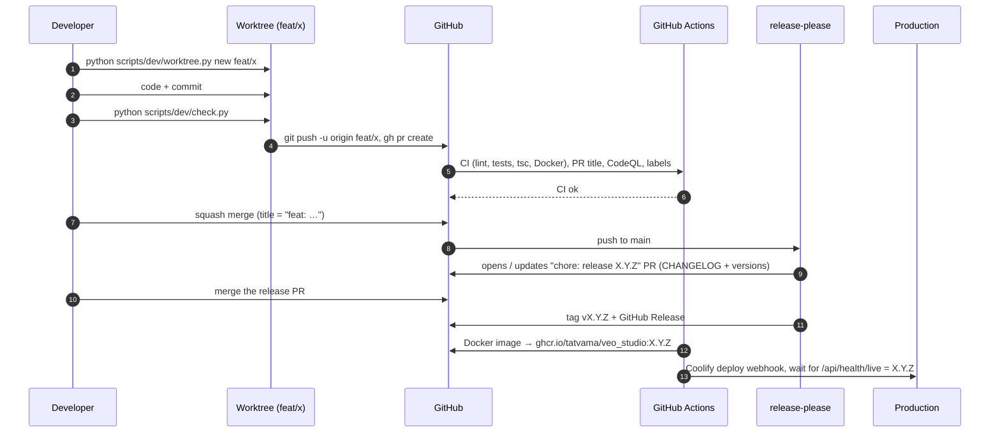

# Contributing and the development workflow

How changes go from an idea to production. Setup of the app itself is in the [README](README.md#quick-start-local-development).

- [The flow in one picture](#the-flow-in-one-picture)
- [1. Start a task in its own worktree](#1-start-a-task-in-its-own-worktree)
- [2. Commit](#2-commit)
- [3. Check locally](#3-check-locally)
- [4. Pull request](#4-pull-request)
- [5. Merge](#5-merge)
- [Releases](#releases)
- [Deployment](#deployment)
- [Hotfixes](#hotfixes)
- [Cleaning up](#cleaning-up)
- [Repository settings](#repository-settings)
- [Rules of the house](#rules-of-the-house)

## The flow in one picture



## 1. Start a task in its own worktree

Every task gets its own branch **and its own folder** (a git worktree), so several tasks, people or Claude sessions can
work at once without touching each other's uncommitted files. The main checkout stays on `main`.

```bash
python scripts/dev/worktree.py new feat/poster-export
```

This fetches `origin`, creates the branch from the latest `origin/main` in `.claude/worktrees/feat-poster-export`,
copies your `.env` into it and runs `npm ci` in `frontend/`. The backend virtualenv is shared: `check.py` and the
commands below find the main checkout's `backend/.venv` automatically, so there is nothing to install per worktree.

Branch names: `<type>/<short-topic>`, lower case, e.g. `feat/poster-export`, `fix/timeline-ducking`,
`docs/mcp-setup`, `chore/bump-node`. Types are the same as for commits (below).

Running the app from a worktree: build its frontend (`npm run build` in `frontend/`) and start uvicorn from its
`backend/` with the shared venv. Port 8100 can only be used by one server at a time: stop the other one first, or use
another port for a short test (and stop it afterwards).

## 2. Commit

Commit as often as you like on your branch; messages on the branch are free-form. What matters is the **pull request
title**, because pull requests are squash-merged and the title becomes the single commit on `main` and the line in
the changelog. Using [Conventional Commits](https://www.conventionalcommits.org/) on the branch too is a good habit.

| Type | Use for | Release |
|---|---|---|
| `feat` | A new feature or visible improvement | minor (3.**1**.0) |
| `fix` | A bug fix | patch (3.0.**1**) |
| `perf` | Faster, cheaper, no behaviour change | patch |
| `refactor` | Code change with no behaviour change | patch |
| `docs` | Documentation only | patch |
| `build` | Dependencies, Dockerfile, build config | patch |
| `revert` | Reverting an earlier change | patch |
| `ci`, `test`, `style`, `chore` | CI, tests, formatting, housekeeping | none (hidden from the changelog) |

A breaking change (an API, setting or database change that needs action from whoever upgrades) gets a `!`
(`feat!: …`) or a `BREAKING CHANGE: …` paragraph in the body, and makes a major release.

Scopes are optional and name the area: `director`, `mcp`, `providers`, `shots`, `timeline`, `posters`, `cast`,
`story`, `deliver`, `hub`, `auth`, `db`, `storage`, `ui`, `deps`. Examples:

```
feat(mcp): continue_scenes prompt picks up after the last approved scene
fix(timeline): keep music ducking after a roll trim
perf(providers): reuse the fal.ai client between jobs
build(deps): bump fastapi to 0.136
```

## 3. Check locally

```bash
python scripts/dev/check.py
```

Runs exactly what CI runs: ruff (backend lint), pytest (177 tests, about 7 minutes, mock providers), and `tsc -b` +
`vite build`. `--fast` runs only lint + typecheck (seconds), `--backend` / `--frontend` one side. CI additionally
builds the Docker image and starts it (smoke test), which needs Docker and is left to CI.

## 4. Pull request

```bash
git push -u origin feat/poster-export
```

```bash
gh pr create --fill --title "feat(posters): export to 300 dpi CMYK PDF"
```

Fill in the [template](.github/pull_request_template.md): what and why, how it was tested (mock or real providers,
and the spend), screenshots for UI changes. On every push GitHub runs:

| Check | Required | What |
|---|---|---|
| **CI ok** | yes | Backend lint + tests, frontend typecheck + build, Docker build + smoke test |
| Conventional PR title | yes | The title format above |
| CodeQL | no (results under Security) | Security scanning |
| Labeler | — | Adds area labels |

## 5. Merge

When the checks are green (and review is done when there is a reviewer): **Squash and merge**. Keep the PR title as the
commit title. The branch is deleted on GitHub automatically; run `worktree.py clean` locally (below).

`gh pr merge --squash --auto` merges by itself as soon as the checks pass.

## Releases

Releases are automatic with [release-please](https://github.com/googleapis/release-please):

1. After every merge to `main`, release-please updates a pull request called **`chore: release X.Y.Z`**. It contains
   the next version (from the commit types since the last release) and the new [CHANGELOG.md](CHANGELOG.md) section.
2. Merge it when you want to release. That tags `vX.Y.Z`, creates the GitHub Release with the changelog, and
   publishes the Docker image `ghcr.io/tatvama/veo_studio` with tags `X.Y.Z`, `X.Y`, `X` and `latest`.
3. The version is written to `version.txt`, `backend/app/__init__.py` (shown by `GET /api/health/live`) and
   `frontend/package.json`. Don't edit these or the released sections of `CHANGELOG.md` by hand.

Note: GitHub doesn't run workflows for pull requests opened with the built-in token, so CI doesn't run on the release
PR. Either merge it as an admin (it only changes the changelog and version numbers), or add a fine-grained personal
access token as the `RELEASE_PLEASE_TOKEN` secret (repository access: this repo; permissions: Contents and Pull
requests, read and write) so release PRs get CI like any other.

To force a specific version, put `Release-As: 4.0.0` in the body of a commit on `main`.

## Deployment

After a release image is published, the **Deploy to production** job runs in the `production` environment:

| Setting (GitHub → Settings → Secrets and variables → Actions) | Type | Value |
|---|---|---|
| `COOLIFY_WEBHOOK_URL` | secret | Coolify → the app → Webhooks → deploy webhook URL |
| `COOLIFY_TOKEN` | secret | Coolify → Keys & Tokens → API token with deploy permission |
| `PRODUCTION_URL` | variable | e.g. `https://studio.example.com`; the job waits until `/api/health/live` reports the new version |

Without the webhook secret the job only records that the release wasn't deployed. To require a person to approve
each production deploy, add yourself as a required reviewer under **Settings → Environments → production**. If
Coolify also auto-deploys on every push to `main`, turn that off so only released versions go live.

## Hotfixes

Same flow, just quick: `worktree.py new fix/<topic>`, a `fix:` PR, merge, then merge the release PR straight away.
To roll back: **Actions → Release → Run workflow** with `publish_tag` = the previous good tag (e.g. `v3.0.0`). That
rebuilds and publishes that release's image (moving the `X`, `X.Y` and `latest` tags to it) and deploys it. Or pin
`image: ghcr.io/tatvama/veo_studio:<previous>` in Compose / Coolify. Then fix forward with a `revert:` or `fix:` PR.

## Cleaning up

```bash
python scripts/dev/worktree.py list
```

```bash
python scripts/dev/worktree.py clean
```

`clean` removes worktrees and local branches that are merged (contained in `origin/main`, remote branch deleted after
merge, or a merged PR on GitHub), after asking. Worktrees with uncommitted changes, and the one you are standing in,
are never removed.

## Repository settings

The GitHub settings this workflow expects (an admin sets them once):

- **Pull requests:** squash merging only, default commit title = PR title; "Automatically delete head branches" on;
  "Allow auto-merge" on.
- **Ruleset on `main`:** require a pull request; require the status checks **CI ok** and **Conventional PR title**;
  block force pushes and deletion. Admins may bypass (needed for the release PR without `RELEASE_PLEASE_TOKEN`).
- **Security:** Dependabot alerts and security updates, secret scanning with push protection, private vulnerability
  reporting.

## Rules of the house

- **Never commit `.env`**, keys, tokens or customer media. `.env.example` lists every variable with empty values.
- **Paid AI calls** go through the job system with an estimate and the budget/approval checks; tests run in mock
  mode and must never spend.
- **Google first** stays strict: don't add a silent fallback that spends on another provider (fallbacks are opt-in
  settings).
- **Database changes** must upgrade existing databases on start (`backend/app/db_migrate.py`); never drop user data.
- **One server, one port (8100)** serves the API and the built frontend. Stop throwaway servers when you're done.
- **New project pages** go inside one of the five steps (Story, Cast, Shots, Edit, Deliver), not as new tabs.
- **English UI**: new interface text is English; translations aren't maintained.
- Small, focused PRs. One task, one branch, one worktree.
