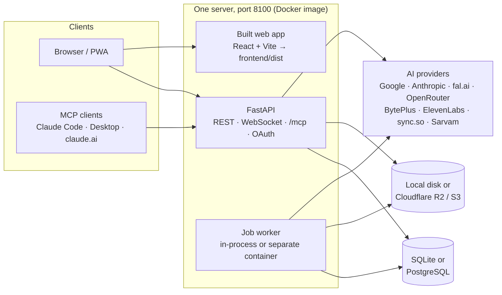
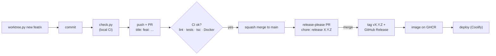

# Tatvam AI Studio

[](https://github.com/tatvama/veo_studio/actions/workflows/ci.yml)
[](https://github.com/tatvama/veo_studio/actions/workflows/codeql.yml)
[](https://github.com/tatvama/veo_studio/releases)
[](https://www.conventionalcommits.org/)

An AI video studio for teams. Give it a concept and it takes you from hook to script, scene plan, cast and voices,
shot list, keyframes, video, lip-sync, music, sound and the final edit, in **English, Hindi, Kannada, Telugu and Tamil**.

It isn't tied to one AI provider. It is **Google first** (Veo, Gemini, Nano Banana, Lyria), and the **Model Hub** keeps a
live catalog of about 800 more models (Kling, Seedance, Wan, MiniMax, LTX, Luma, Grok, sync.so, HeyGen, ElevenLabs …)
through fal.ai, OpenRouter and BytePlus. The **Director** agent (Claude or Gemini) can do any step for you, and an
**MCP server** lets Claude Code, Claude Desktop and claude.ai run the whole pipeline. Paid steps always show the cost first.

| | |
|---|---|
| **Use it** | [User guide](docs/USER_GUIDE.md) · [MCP server](docs/MCP.md) · [Design system](docs/DESIGN.md) |
| **Build it** | [Contributing & dev workflow](CONTRIBUTING.md) · [Changelog](CHANGELOG.md) · [Security](SECURITY.md) |
| **Plan** | [TATVAM_PLAN.md](TATVAM_PLAN.md) (the working plan) · [docs/V3.md](docs/V3.md) (v3 design) · [PLAN.md](PLAN.md) (original plan, kept as a record) |

---

## Contents

1. [Features](#features)
2. [Architecture](#architecture)
3. [Quick start (local development)](#quick-start-local-development)
4. [Configuration: environment variables](#configuration-environment-variables)
5. [Third-party services](#third-party-services)
6. [Third-party libraries and tools](#third-party-libraries-and-tools)
7. [MCP server (Claude Code, Claude Desktop, claude.ai)](#mcp-server-claude-code-claude-desktop-claudeai)
8. [Deployment](#deployment)
9. [Development workflow, CI/CD and releases](#development-workflow-cicd-and-releases)
10. [Testing](#testing)
11. [Project structure](#project-structure)
12. [Status: what's verified](#status-whats-verified)

---

## Features

A project goes through an **Overview** and **five steps** (details in the [user guide](docs/USER_GUIDE.md)):

| Step | What you do |
|---|---|
| **1 Story** | Brief (AI fills audience, tone, CTA; trend scout), 6 scored hooks, script writing with the **writers' room** (critic loop, table read in the cast voices, continuity check, native-speaker localization), versions with diff and restore, `@mentions`, scene cards |
| **2 Cast** | Characters and places from the script, reference sheets, **Character Lock** (face, body, voice, costume, gestures), costumes with turnarounds, props, wardrobe timeline, continuity bible, identity (LoRA) training, consent records |
| **3 Shots** | Storyboard · List · Studio views; keyframes then videos, engine picker per shot, **shootouts** between 2–4 engines, Film Map shot links, scene continuity (anchor shot first, keyframe QC with automatic retake), Enhance |
| **4 Edit** | Professional timeline: J/K/L, roll trims, speed, keyframes, waveforms, Auto SFX, titles, caption preview, music ducking |
| **5 Deliver** | Render for Shorts / Reels / YouTube with karaoke captions and brand end cards, dubbing, cut-downs, marketing pack, YouTube publishing, client review links, Ads & Reels campaigns, **Poster Studio** |

Across the app: the **Director** agent (`Ctrl+J`), **Autopilot**, the **Model Hub** with routing chains (Saver / Balanced /
Hero) and automatic fallbacks, budgets with team, personal and project caps, an approvals inbox, rupees beside
dollars, audit log, roles (Admin, Producer, Creator, Reviewer, Viewer), command palette (`Ctrl+K`), dark/light themes,
installable PWA, and **Mock mode** so the whole flow runs free before you add any keys.

## Architecture



- **Backend:** Python 3.12, FastAPI, SQLAlchemy 2. The database is also the job queue: API requests create jobs, the
  worker claims them, calls the providers, runs FFmpeg and writes takes. The database upgrades itself on start.
- **Frontend:** React 19 + TypeScript + Vite + Tailwind, served by the backend from `frontend/dist` in production, so
  the API and the web app share **one port (8100)**.
- **Storage:** `local` keeps media on disk; `s3` makes a Cloudflare R2 / S3 bucket the shared store with the local
  media folder as a cache (needed when several machines or containers share media, and for BytePlus/OpenRouter, which
  fetch input images by link).

## Quick start (local development)

### Prerequisites

| Tool | Version | Notes |
|---|---|---|
| Python | 3.12 | Windows: `winget install Python.Python.3.12` |
| Node.js | 22 or newer | Windows: `winget install OpenJS.NodeJS.LTS` |
| Git | any recent | plus the [GitHub CLI](https://cli.github.com/) (`gh`) for pull requests |
| FFmpeg | optional | a bundled FFmpeg (imageio-ffmpeg) is used when none is set; set `FFMPEG_PATH` to use your own |
| Docker | optional | only for the production-like `docker compose` setup |

### 1. Clone and configure

```bash
git clone https://github.com/tatvama/veo_studio.git
```

```bash
cd veo_studio
```

Copy `.env.example` to `.env` (Windows: `copy .env.example .env`; macOS/Linux: `cp .env.example .env`). You can leave
every key empty to start in Mock mode. See [Configuration](#configuration-environment-variables) for each variable.

### 2. Backend

Windows (PowerShell):

```powershell
cd backend; py -3.12 -m venv .venv; .venv\Scripts\python -m pip install -r requirements-dev.txt
```

macOS / Linux:

```bash
cd backend && python3.12 -m venv .venv && .venv/bin/python -m pip install -r requirements-dev.txt
```

`requirements-dev.txt` installs the app's `requirements.txt` plus the lint tool. Optional, recommended: download the
two OpenCV face models (≈ 37 MB) so QC measures face similarity instead of only asking the vision model:

```bash
backend/.venv/Scripts/python scripts/get_face_models.py
```

### 3. Frontend

```bash
cd frontend && npm ci
```

### 4. Run it

**One server on port 8100** (API + web app, like production). Build the web app, then start the API:

```bash
cd frontend && npm run build
```

```bash
cd backend && .venv/Scripts/python -m uvicorn app.main:app --port 8100 --reload
```

Open **http://localhost:8100**. (macOS/Linux: use `.venv/bin/python`.)

**Working on the frontend?** Run Vite with hot reload on port 5173 in a second terminal; it proxies `/api`, `/media`
and the WebSocket to the API on 8100. Open http://localhost:5173 while you work, and rebuild `frontend/dist` when done.

```bash
cd frontend && npm run dev
```

### 5. First sign-in

The first visit asks you to create the **admin account**, then a short tour shows you around.

**No keys yet?** With `MOCK_PROVIDERS=auto` the studio uses free placeholder images, video and voices for every
service without a key, so the team can learn the whole flow before spending anything. Add keys in `.env` or in the
app under **Settings → AI services & API keys** (admins only; keys saved there are encrypted with `APP_SECRET`).

### Test your keys against the real services (Phase 0, about $10)

```bash
backend/.venv/Scripts/python spike/run_spike.py --list
```

```bash
backend/.venv/Scripts/python spike/run_spike.py --all --budget 15
```

It writes `spike/results/<date>/report.md` with every clip, image and voice sample: do the model IDs exist on your
key, does Veo keep the face from the keyframe, how good is Veo's own Hindi/Kannada/Telugu/Tamil dialogue, how do
lip-sync and the voice changer sound. Voice samples in `listen/` have code names for a blind listening test.

## Configuration: environment variables

Settings are read from `.env` in the repository root (see [.env.example](.env.example)) or from the process
environment (Docker, Coolify). AI keys can also be saved in the app (**Settings → AI services**), which takes
precedence. **Never commit `.env`.**

### App and security

| Variable | Default | Description |
|---|---|---|
| `APP_SECRET` | `dev-only-secret-change-me` | **Required in production.** Long random string; signs logins and encrypts API keys saved in the app. Changing it logs everyone out and makes saved keys unreadable. |
| `PUBLIC_BASE_URL` | `http://localhost:8100` | The address people open. Used in client review links, OAuth redirects and as the MCP server's address / OAuth issuer (must be **HTTPS** for claude.ai connectors). |
| `COOKIE_SECURE` | `false` | Set `true` when served over HTTPS. |
| `FRONTEND_ORIGIN` | `http://localhost:5173` | Where to send the browser back after Google / YouTube sign-in in Vite dev mode. Docker Compose sets it to `PUBLIC_BASE_URL`. |
| `MOCK_PROVIDERS` | `auto` | `auto` = placeholder output for services without a key; `false` = fail instead; `true` = always placeholders (no spend). |

### Database

| Variable | Default | Description |
|---|---|---|
| `DATABASE_URL` | *(empty → SQLite at `data/studio.db`)* | e.g. `postgresql+psycopg://veo:<password>@db:5432/veo`. SQLite is fine for one machine. |
| `POSTGRES_PASSWORD` | — | Used by `docker-compose.yml` for its Postgres container. |
| `DB_POOL_SIZE` / `DB_MAX_OVERFLOW` | `5` / `10` | Postgres pool per process. Keep (pool + overflow) × processes under the server's `max_connections`. |
| `DB_POOL_RECYCLE_S` | `300` | Recycle idle connections before a remote server or NAT drops them. |
| `DB_CONNECT_TIMEOUT_S` | `10` | Connect timeout for remote Postgres. |

### Media storage

| Variable | Default | Description |
|---|---|---|
| `STORAGE_BACKEND` | `local` | `local` = this machine's disk; `s3` = bucket is the shared store, local folder is a cache. |
| `S3_ENDPOINT_URL` | — | R2: `https://<account-id>.r2.cloudflarestorage.com` |
| `S3_BUCKET` | — | Bucket name. |
| `S3_ACCESS_KEY_ID` / `S3_SECRET_ACCESS_KEY` | — | R2 API token (or S3) credentials. |
| `MEDIA_ROOT` / `DATA_ROOT` | `./media` / `./data` | Media cache and SQLite/data folders. The Docker image uses `/data/media` and `/data/db`. |

### AI services

All optional: a service without a key runs in Mock mode (with `MOCK_PROVIDERS=auto`).

| Variable | Service | Used for |
|---|---|---|
| `GEMINI_API_KEY` | Google Gemini API | Images (Nano Banana), Veo 3.1 video, TTS and voice design, Omni edits, Lyria music, listening checks (lip-sync, spoken words), embeddings for search; writing and vision QC when there is no Anthropic key or Gemini is picked in Settings. **Veo needs billing enabled.** |
| `ANTHROPIC_API_KEY` | Anthropic Claude | All writing and reviews on Claude Opus 5.5 (briefs, hooks, scripts, bible, shot lists, critic, localisation, keyframe and clip QC, trend research with web search) and the Director chat agent on Claude Sonnet 5.5. Both are the defaults; Gemini is used when this is missing or picked in Settings. |
| `FAL_KEY` | fal.ai | The Model Hub catalog (~800 models: Kling, Seedance, Wan, MiniMax, LTX, sync, HeyGen …) and identity (LoRA) training. |
| `OPENROUTER_API_KEY` | OpenRouter | One key for many video models (Seedance, Kling, Wan, Veo, Hailuo …), images, and an optional text route. |
| `BYTEPLUS_API_KEY` | BytePlus ModelArk | Seedance video and Seedream images, direct from ByteDance. |
| `BYTEPLUS_ACCESS_KEY` / `BYTEPLUS_SECRET_KEY` | BytePlus IAM | Register AI characters in the private asset library so Seedance keeps them consistent (needs `STORAGE_BACKEND=s3`). |
| `BYTEPLUS_REGION` / `BYTEPLUS_PROJECT` | BytePlus | Default `ap-southeast-1` / `default`. |
| `ELEVENLABS_API_KEY` | ElevenLabs | Premium voices, Voice Lock (voice changer), voice design, sound effects, audio clean-up. |
| `SYNC_API_KEY` | sync.so | Lip-sync. |
| `SARVAM_API_KEY` | Sarvam AI | Indian-language voices (Bulbul). |

### Spend and money

| Variable | Default | Description |
|---|---|---|
| `GEMINI_SPEND_PER_10MIN` | `10` | Google caps paid spend per rolling 10 minutes by tier (Tier 1: $10, Tier 2: $50, Tier 3: $200). Veo jobs wait instead of crossing it. `0` = off. |
| `USD_INR_RATE` | `0` | Pin the rupee display rate (e.g. `94.5`); `0` = live rate. |
| `SPIKE_BUDGET_USD` | `30` | Budget stop for `spike/run_spike.py`. |

Team, personal and project budgets are set in the app (**Settings → Budget**).

### Worker

| Variable | Default | Description |
|---|---|---|
| `RUN_WORKER_IN_PROCESS` | `true` | Run the job worker inside the API process. Docker Compose sets `false` and runs a separate `worker` container. |
| `WORKER_CONCURRENCY` | `4` | Jobs run at the same time. |
| `WORKER_HEARTBEAT_FILE` | temp dir | Heartbeat file the worker health check reads. |
| `PORT` | `8100` | Port the `python -m app.health api` probe calls. |

### Sign-in and integrations

| Variable | Default | Description |
|---|---|---|
| `GOOGLE_CLIENT_ID` / `GOOGLE_CLIENT_SECRET` | — | Google sign-in and YouTube publishing. Redirect URIs: `<PUBLIC_BASE_URL>/api/auth/google/callback` and `<PUBLIC_BASE_URL>/api/integrations/youtube/callback` (enable YouTube Data API v3 and YouTube Analytics API). |
| `ALLOWED_GOOGLE_DOMAINS` | — | Email domains that may sign in with Google as Viewers (comma separated). Empty = invited emails only. |
| `MAKE_WEBHOOK_URL` | — | Make.com webhook called when a render is published (also settable in the app). |
| `CLOUDFLARE_TUNNEL_TOKEN` | — | For `docker compose --profile tunnel up -d`. |

### MCP server

| Variable | Default | Description |
|---|---|---|
| `MCP_ENABLED` | `true` | Serve the MCP endpoint at `/mcp`. |
| `MCP_ALLOWED_HOSTS` | — | Extra host names `/mcp` answers to (comma separated; `*` = any, every request still needs a token). `PUBLIC_BASE_URL`'s host and localhost always work. |
| `TATVAM_TOKEN` | — | Token for the **stdio** MCP server (`python -m app.mcp_server`). |

### Media tools

| Variable | Default | Description |
|---|---|---|
| `FFMPEG_PATH` | bundled | Path to your own FFmpeg (with libass + harfbuzz for Indic captions). |
| `CAPTION_FONT` | `Nirmala UI` (Windows) / `Noto Sans` | Caption font. The Docker image ships Noto fonts for all five scripts. |

### Development and CI

| Variable | Where | Description |
|---|---|---|
| `VEO_API` | frontend dev | Vite proxy target (default `http://localhost:8100`). |
| `VEO_PYTHON` | `scripts/dev/check.py` | Python to use instead of the auto-detected `backend/.venv`. |
| `RELEASE_PLEASE_TOKEN` | GitHub secret, optional | PAT so CI runs on release pull requests. |
| `COOLIFY_WEBHOOK_URL` / `COOLIFY_TOKEN` | GitHub secrets, optional | Deploy to Coolify after each release. |
| `PRODUCTION_URL` | GitHub variable, optional | Checked after deploy until `/api/health/live` reports the new version. |

## Third-party services

| Service | What the studio uses it for | Config | Needed? |
|---|---|---|---|
| [Google Gemini API](https://ai.google.dev/) | Veo 3.1 (Lite / Fast / standard) video with native dialogue, Gemini 3.x text and vision QC, Nano Banana 2.1 and Gemini 3 Pro Image, Gemini TTS, Lyria music, Omni edits, embeddings | `GEMINI_API_KEY` | Recommended (default engine) |
| [Anthropic Claude API](https://docs.anthropic.com/) | Writing and reviews (Claude Opus 5.5, structured output, web search), Director chat agent (Claude Sonnet 5.5) | `ANTHROPIC_API_KEY` | Recommended (default writer) |
| [fal.ai](https://fal.ai/) | Model Hub catalog of ~800 models (Kling, Seedance, Wan, MiniMax, LTX, Luma, HeyGen, sync …), identity (LoRA) training | `FAL_KEY` | Optional |
| [OpenRouter](https://openrouter.ai/) | Video and image models through one key, optional text route | `OPENROUTER_API_KEY` | Optional |
| [BytePlus ModelArk](https://www.byteplus.com/en/product/modelark) | Seedance 2.x video, Seedream images, character asset library | `BYTEPLUS_*` | Optional |
| [ElevenLabs](https://elevenlabs.io/) | Voices (eleven v3), voice changer, voice design, SFX, audio isolation | `ELEVENLABS_API_KEY` | Optional |
| [sync.so](https://sync.so/) | Lip-sync (lipsync-2 / lipsync-2-pro) | `SYNC_API_KEY` | Optional |
| [Sarvam AI](https://www.sarvam.ai/) | Indian-language TTS (Bulbul v3) | `SARVAM_API_KEY` | Optional |
| [Google Cloud OAuth](https://console.cloud.google.com/) + YouTube Data / Analytics APIs | Google sign-in, YouTube publishing and analytics | `GOOGLE_CLIENT_*` | Optional |
| [Cloudflare R2](https://developers.cloudflare.com/r2/) (or any S3) | Shared media store | `S3_*` | Needed for multi-machine setups and BytePlus/OpenRouter |
| [Cloudflare Tunnel](https://developers.cloudflare.com/cloudflare-one/connections/connect-networks/) | Team access from anywhere without opening ports | `CLOUDFLARE_TUNNEL_TOKEN` | Optional |
| [PostgreSQL](https://www.postgresql.org/) 16 | Production database (SQLite otherwise) | `DATABASE_URL` | Production |
| [open.er-api.com](https://open.er-api.com/) / [frankfurter.dev](https://frankfurter.dev/) | Live USD → INR rate (no key; the last good rate is kept) | `USD_INR_RATE` to pin | Automatic |
| [OpenCV Zoo](https://github.com/opencv/opencv_zoo) | YuNet + SFace face models for objective face-match QC (downloaded once) | `scripts/get_face_models.py` | Optional |
| [Make.com](https://www.make.com/) | Webhook for publishing to other platforms | `MAKE_WEBHOOK_URL` | Optional |
| [Coolify](https://coolify.io/) | Self-hosted deployment target (health checks, deploy webhook) | GitHub secrets | Optional |
| [GitHub](https://github.com/) Actions, CodeQL, Dependabot, GHCR | CI, code scanning, dependency updates, release images | — | Development |

## Third-party libraries and tools

### Backend (Python, [backend/requirements.txt](backend/requirements.txt))

| Library | Purpose |
|---|---|
| FastAPI, Uvicorn, python-multipart | Web framework, ASGI server, uploads |
| SQLAlchemy 2, psycopg 3, pg8000 | ORM and Postgres drivers (SQLite built in) |
| Pydantic 2, pydantic-settings | Data validation and `.env` settings |
| httpx | HTTP client for the provider REST APIs |
| anthropic | Official Claude SDK (writing, reviews, Director agent) |
| fal-client | fal.ai SDK (Model Hub, training) |
| mcp 2.x | Model Context Protocol server SDK |
| boto3 | S3 / Cloudflare R2 storage |
| bcrypt, itsdangerous, cryptography | Password hashing, signed sessions, encryption of saved keys |
| Pillow, numpy, opencv-python-headless | Images, face detection and similarity QC |
| imageio-ffmpeg | Bundled FFmpeg binary (render, captions, reframe, audio) |
| pypdf | Script import from PDF |
| pytest | Tests |
| ruff *(dev)* | Lint ([backend/ruff.toml](backend/ruff.toml)) |
| torch, torchaudio, demucs *(optional Docker build arg)* | CPU voice/background separation for Voice Lock |

### Frontend (TypeScript, [frontend/package.json](frontend/package.json))

| Library | Purpose |
|---|---|
| React 19, React DOM, React Router 7 | UI and routing |
| Vite 8, TypeScript 7, @vitejs/plugin-react | Build and type checking |
| Tailwind CSS 4, clsx, tailwind-merge | Styling |
| TanStack Query 5, Zustand 5 | Server state and client state |
| @xyflow/react | Film Map (shot-to-shot link graph) |
| dockview | Dockable panels in the Studio view |
| Konva, react-konva | Poster Studio canvas |
| @dnd-kit | Drag and drop (storyboard, timeline, lists) |
| motion | Animations |
| lucide-react | Icons |
| sonner | Toasts |
| @fontsource / @fontsource-variable | Bundled fonts incl. Devanagari, Kannada, Telugu and Tamil display faces |

### Runtime and infrastructure

| Tool | Purpose |
|---|---|
| Docker (`python:3.12-slim`, `node:22-slim`) | One image: API + worker + built web app, FFmpeg with libass/harfbuzz, Noto fonts |
| Docker Compose | `db` (postgres:16-alpine), `api`, `worker`, optional `tunnel` (cloudflare/cloudflared) |
| GitHub Actions | CI, CodeQL, PR checks, release-please releases, GHCR images, deploy |

## MCP server (Claude Code, Claude Desktop, claude.ai)

The studio is also an **MCP server**, so Claude (or any MCP app) can read and improve a script, plan scenes, build the
storyboard and make the videos scene by scene with continuity carried forward. It runs on the same port at
**`<PUBLIC_BASE_URL>/mcp`** (Streamable HTTP). Full tool list and design: [docs/MCP.md](docs/MCP.md).

**1. Create a token:** in the app, **Settings → MCP access → Create a token**, with scopes:

| Scope | Allows |
|---|---|
| `read` | Look at projects, scripts, storyboards, jobs |
| `write` | Change scripts, scenes and shots, run AI writing, and **propose** paid work (nothing is spent) |
| `spend` | Approve proposals and start paid work (budget limits still apply) |

**2. Connect a client:**

Claude Code:

```bash
claude mcp add --transport http tatvam http://localhost:8100/mcp --header "Authorization: Bearer tvm_…"
```

Claude Desktop and other apps (JSON config):

```json
{
  "mcpServers": {
    "tatvam": {
      "type": "http",
      "url": "http://localhost:8100/mcp",
      "headers": { "Authorization": "Bearer tvm_…" }
    }
  }
}
```

Apps that can only start a command can use **stdio** (the app on port 8100 must keep running, since it runs the
jobs): in `backend/`, set `TATVAM_TOKEN=tvm_…` and run `.venv/Scripts/python -m app.mcp_server`.

**claude.ai (custom connector):** add `<PUBLIC_BASE_URL>/mcp`. claude.ai registers itself (OAuth with dynamic client
registration + PKCE), sends you to `/oauth/consent` in the studio to approve it and pick scopes. Needs an **HTTPS**
`PUBLIC_BASE_URL` (Cloudflare Tunnel or Coolify with TLS). Connected apps are listed and can be disconnected in
Settings → MCP access.

**Safety:** paid tools return a *proposal* (batch id + estimate) and spend nothing until `approve_spend` (needs `spend`)
or approval in the app. Tools that would overwrite a script, shot list or scene cards ask for confirmation first.
Tokens are stored as hashes; personal tokens can expire and can be limited to some projects. Prompts available as
slash commands: `film_from_script`, `improve_script`, `storyboard_review`, `continue_scenes`.

## Deployment

### Docker Compose (Unraid, a VPS or Docker Desktop)

1. Copy `.env.example` to `.env` and set `APP_SECRET`, `POSTGRES_PASSWORD`, `PUBLIC_BASE_URL` and your keys.
2. Start it:

```bash
docker compose up -d --build
```

3. Open `http://<server-ip>:8100` and create the first admin.

Data lives in `./data/` (Postgres + media): back it up. For team access from anywhere without opening router ports,
add `CLOUDFLARE_TUNNEL_TOKEN` and run `docker compose --profile tunnel up -d`, then set `COOKIE_SECURE=true`.

**Released images:** every release is published to `ghcr.io/tatvama/veo_studio` with tags `X.Y.Z`, `X.Y`, `X` and `latest`,
so a server can pull a tested image instead of building (`image: ghcr.io/tatvama/veo_studio:3` in place of `build: .`).

**Voice Lock separation (optional):** `docker compose build --build-arg WITH_DEMUCS=1` adds CPU voice/background
separation (~1 GB); the default uses ElevenLabs audio isolation.

### Coolify

Set the same variables in the app's Environment. The AI keys are read by both the API and the worker. Health check:
port `8100`, path `/api/health/live`, start period about a minute. To deploy automatically on each release, add the
`COOLIFY_WEBHOOK_URL` and `COOLIFY_TOKEN` secrets to GitHub (see [releases](#development-workflow-cicd-and-releases))
and turn off Coolify's own deploy-on-push, so only released versions go live.

### Health checks

| Check | Use |
|---|---|
| `GET /api/health/live` | Liveness and version (`{"ok":true,"version":"3.0.0",…}`). Never touches the database. |
| `GET /api/health/ready` | Readiness: 200 when the database (and an in-process worker) is fine, 503 with details otherwise. |
| `python -m app.health api` | The image's built-in Docker `HEALTHCHECK` (no curl needed). |
| `python -m app.health worker` | The worker container's check (job loop heartbeat). |

## Development workflow, CI/CD and releases

The full guide is in [CONTRIBUTING.md](CONTRIBUTING.md). In short:



| Command | What it does |
|---|---|
| `python scripts/dev/worktree.py new feat/my-change` | New branch + worktree from the latest `origin/main` in `.claude/worktrees/`, with `.env` copied and `npm ci` done |
| `python scripts/dev/check.py` | The same checks as CI: ruff, pytest, `tsc -b` + Vite build (`--fast` for lint + typecheck only) |
| `python scripts/dev/worktree.py list` / `clean` | Show worktrees and merge state / remove merged worktrees and branches |

**Automation on GitHub:**

| Workflow | When | What |
|---|---|---|
| [CI](.github/workflows/ci.yml) | Every PR and push to `main` | Backend lint + tests, frontend typecheck + build, Docker build + smoke test, then the required **CI ok** check |
| [PR title](.github/workflows/pr-title.yml) | PR opened / edited | Title must follow Conventional Commits (it becomes the changelog line) |
| [Labeler](.github/workflows/labeler.yml) | PR opened / updated | Labels by area: backend, frontend, mcp, providers, docs, ci, docker, dependencies |
| [CodeQL](.github/workflows/codeql.yml) | PRs, `main`, weekly | Security scanning of Python and TypeScript |
| [Release](.github/workflows/release.yml) | Push to `main` | release-please release PR → tag + GitHub Release → GHCR image → optional Coolify deploy |
| [Dependabot](.github/dependabot.yml) | Weekly (Mondays) | Grouped pip, npm and GitHub Actions updates |

Versions follow [SemVer](https://semver.org/): `feat` → minor, `fix` → patch, `feat!` / `BREAKING CHANGE` → major. The
version lives in `version.txt`, `backend/app/__init__.py` and `frontend/package.json`, all bumped by the release PR.

## Testing

```bash
cd backend && .venv/Scripts/python -m pytest
```

About 180 tests, all in mock mode (about 7 minutes): the full pipeline end to end (concept → hooks → script → bible → sheets →
voices → shots → keyframes → videos + QC → lip-sync → music → animatic → export → dubbing → Director → approvals),
Model Hub schema mapping on real fal.ai schemas, routing and fallbacks, Google-first and cheapest-route rules,
providers, MCP (HTTP, tokens, OAuth, the whole pipeline with continuity checks, spend scope), scene chain and scene
continuity, Poster Studio, health checks, storage, database migrations and resilience. Tests use a temporary SQLite
database and local storage, never the real bucket or keys from `.env`.

Frontend: `cd frontend && npm run build` (type check + production build). In development, `/dev/kit` shows every
shared component in the current theme.

## Project structure

```
.github/             CI/CD workflows, Dependabot, PR and issue templates, CODEOWNERS
backend/app/
  main.py            FastAPI app (API, WebSocket, /mcp, serves frontend/dist)   db_migrate.py  auto-upgrade on start
  config.py          settings from .env    catalog.py  model IDs, prices, languages, voices, presets
  models.py          database tables       settings_store.py  team settings + encrypted API keys
  api/               REST: auth, admin, projects, bible, board, shots, generate, work (jobs, approvals, agent, ws, media),
                     production, campaign, hub (Model Hub), room (writers' room), growth, designs (posters), layers,
                     mcp_access, rates, fx
  core/              studio, generation, model_hub, budget, jobs, lock, continuity, mentions, dependencies (change impact),
                     scene_chain + scene_order (continuity ordering), autopilot, recovery, youtube, audit, rates …
  agents/            director.py (agent loop: Claude or Gemini, keyword mock), director_claude.py, tools.py, prompts.py
  mcp_server/        MCP server, tools, OAuth provider, tokens
  providers/         gemini, claude_text (writing on Claude), fal, openrouter, byteplus, elevenlabs, syncso, sarvam, mock,
                     schema_map, services (llm_json, run_model)
  pipeline/          prompting, voice, captions (karaoke ASS), assembler, ffmpeg, faces, scene_look, approved_stills
  workers/           worker.py (DB job queue), handlers*.py, run.py (separate worker process)
backend/tests/       pytest suite (mock providers)
frontend/src/        pages/, components/, lib/ (api, queries, types, live WebSocket)
scripts/             dev/ (worktree.py, check.py), get_face_models.py, showcase/, i18n/
spike/               Phase 0 real-API checks
docs/                USER_GUIDE.md, MCP.md, V3.md, DESIGN.md
```

## Status: what's verified

**Verified with mock providers:** the full backend suite (179 tests on 10 Oct 2026); every page checked in a browser; upgrading older databases in
place; renders in English and Kannada with correct Indic captions; the MCP pipeline end to end. CI also builds the
Docker image and starts it on every pull request.

**Not yet verified against live services:** real API calls to Google, fal.ai, ElevenLabs, sync.so, Sarvam, OpenRouter
and BytePlus (Phase 0 is that check; Veo needs a billed Gemini key); YouTube upload/analytics; Google sign-in; LoRA
training; keyframe QC scores and retake spend on real images; Postgres beyond the connection layer (tests use SQLite).

**Not built yet:** real-time collaborative editing of the same shot (last save wins, with undo per shot);
Instagram/Facebook direct publishing (use the Make.com webhook or download the render).

---

Security issues: please report privately, see [SECURITY.md](SECURITY.md).
